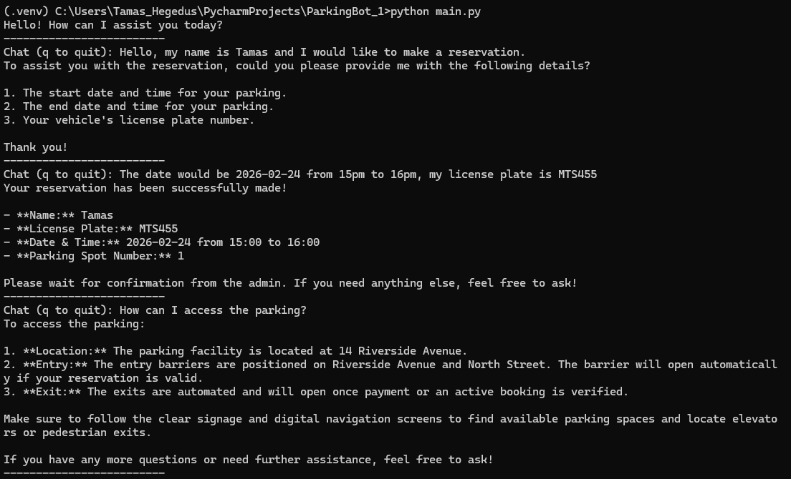
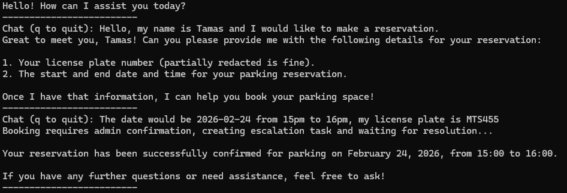
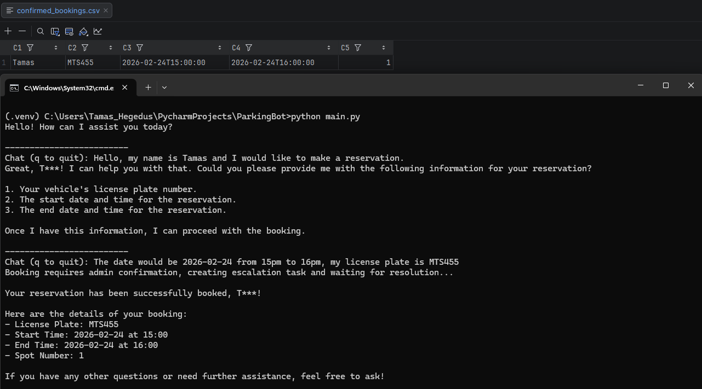

# 🚗 Parking Assistant Chatbot — RAG + SQL Agent

A **LangGraph + LangChain** powered chatbot that combines Retrieval-Augmented Generation (RAG) with SQL querying to provide intelligent parking assistance.

✨ **Key Features**

* 🧠 **RAG retrieval** powered by **Weaviate + LlamaIndex**
* 🗄️ **SQL querying** via `SQLDatabaseToolkit`
* 🧩 Tool-calling agents for bookings and knowledge queries
* 📊 Retrieval evaluation with **Precision@K / Recall@K**
* 🔒 Sensitive-data filtering


---

# ⚙️ Initial Setup

## ✅ Prerequisites

Before starting, ensure you have:

* Docker installed
* Python **3.7+**
* Git

---

## 📥 Clone the Repository

```bash
git clone <your-repo-url>
cd <repo-name>
```

---

## 🔐 Environment Configuration

Add environmental variable:

```bash
OPENAI_API_KEY=<your_openai_key>
```

---

## 🐍 Python Environment Setup

In project root create a virtual environment:

```bash
python -m venv .venv
```

### Activate the environment

**Windows**

```cmd
.venv\Scripts\activate
```

**MacOS / Linux**

```bash
source .venv/bin/activate
```

Install dependencies:

```bash
pip install -r requirements.txt
```

---

## 🗄️ Database & Infrastructure Setup (Docker)

Navigate to the `db_setup` directory and start required services:

```bash
docker-compose up -d
```

This will launch:

* Weaviate vector database
* PostgreSQL database
* Supporting services

After it has started run the init scripts:

```bash
python setup_postgres.py
```

```bash
python setup_weaviate.py
```

---

# ▶️ Running the Chatbot

Start the main application:

```bash
python main.py
```

The chatbot will initialize:

* LangGraph agent
* Retrieval system
* SQL tools
* Vector database connection

---

# 📊 Retrieval Evaluation (Precision@K / Recall@K)

To evaluate retrieval performance, run:

```bash
python test/performance.py
```

This script measures:

* **Precision@K** – How many retrieved chunks are relevant
* **Recall@K** – How many relevant chunks were successfully retrieved

These metrics help tune chunking, embeddings, and retrieval parameters.

---

# Example usage




---

# Task 2

## Human-in-the-Loop & Admin API (new features)

### New features

- Added a REST API implemented with FastAPI to communicate with an administrator review workflow (`admin_api/server.py`).
- Added Human-in-the-loop: after the agent gathers and confirms booking details, the booking is escalated to a human administrator for final confirmation.
- Added `AdminAgent` (`agents/admin_agent.py`) to centralize admin API interactions. The booking tool uses the helper `create_task_and_wait` to create an admin task and block until the admin confirms or refuses the booking.

### How it works

1. The LangGraph/LangChain agent collects booking details from the user and calls the `book_parking_space` tool when information is complete.
2. The `book_parking_space` tool creates an admin review task via the Admin REST API and waits synchronously for the admin decision.
3. The admin inspects the task (via the API or UI) and resolves it with `confirm` or `refuse`.
4. Once the admin resolves the task, the tool returns a final message to the agent and the agent informs the user of the confirmed/refused result.

### Admin REST API — user endpoint reference

- `GET /tasks/{task_id}`
  - Purpose: fetch task details and status.
  - Response JSON: task object with fields like `id`, `booking`, `metadata`, `status`, `resolution`, `created_at`, `updated_at`. When the admin resolves a task the `resolution` field will be present (e.g. `{ "decision": "confirm", "notes": "OK" }`).

- `POST /tasks/{task_id}/resolve`
  - Purpose: admin resolves (confirms/refuses) a pending task.
  - Request JSON: `{ "decision": "confirm" | "refuse", "notes": "optional notes" }`
  - Response JSON: updated task status (e.g. `{ "task_id": "<uuid>", "status": "confirm" }`).

- `GET /tasks`
  - Purpose: list tasks (default lists pending tasks). Returns an array of objects `{ id, created_at }`. For admin to see pending tasks.

### Examples

- Inspect a task (curl):

```bash
curl http://localhost:8001/tasks/<TASK_ID>
```

- Resolve a task (Windows PowerShell example)

Replace `task_id` in the URL with the real id from `/tasks` endpoint:

```powershell
$body = @{
  decision = "confirm"
  notes    = "LGTM, go ahead with the booking."
} | ConvertTo-Json

Invoke-RestMethod `
  -Uri "http://localhost:8001/tasks/task_id/resolve" `
  -Method POST `
  -ContentType "application/json" `
  -Body $body
```

---

# Example usage



---

# Task 3

## MCP Server (persist bookings to file)

Summary of changes

- Added `servers/mcp_server/` : an MCP server that exposes tools.
  - `confirmed_bookings.csv` — CSV file where confirmed bookings are appended.
  - `Dockerfile` + `requirements.txt` for containerization and dependencies.
- Updated `docker-compose.yml` to add the `mcp_server` service so it runs together with the rest of the stack.
- Updated the agent wiring so `ParkingAgent` includes MCP-related tools.
- Updated `main.py` to use the async agent API (`ainvoke` / `astream`) so the graph can call async tools without blocking.

# Example usage



---

# Task 4

### Refactored to graph nodes (usage unchanged)


